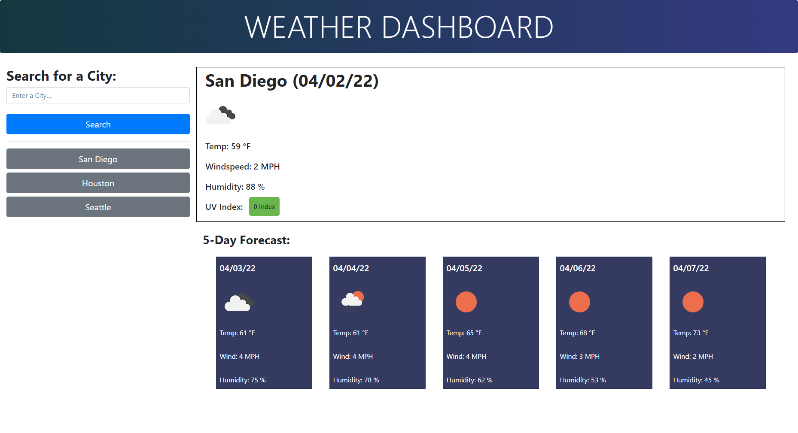

# Weather Dashboard 
## Vladimir Berka's Homework #6

## Assignment Description
This is a CSS/HTML/Javascript homework assignment for the UW Bootcamp. The goal of the assignment is to create a single web page application that is able to fetch data from a Weather API. 

A visual mockup is provided by the instructor to demonstrate desired application functionality, appearance, and criteria.

The original user story, acceptance criteria, and mockup for the assignment is copied to the end of this document.

## Assignment Scope
Create a single web application that allows a user to input any city and search for the current weather of that city using JQuery and the Bootstrap front end framework. Future weather data and localStorage of the search history should be considered. 

No HTML, CSS, or Javascript starting code has been provided.

## Generalized Tasks
- Use the Bootstrap framework and populate the DOM with: dates, search history / search buttons, and miscellaneous weather data - including icons
- Write a javascript file with multiple functions to handle API fetch operations (pull data, write data, save data, parse data - JSON)  
- Use `moment()` and add date information to the webpage
- Use `Buttons` and `listenerEvents` to add web app functionality and responsiveness
- Store search history in `localStorage`

## Summary of Work Completed


## List of Files
* README.md - This current read me file
* index.html - HTML file for the initial website, provided and not 
* ~./assets/style.css - CSS files for the above noted website 
* ~./assets/javascript.js - Javascript file containing functions for the day scheduler
* ~./assets/images/05-third-party-apis-homework-demo.gif - A gif file demonstrating desired functionality provided by the instructor
* ~./assets/images/Work_Day_Scheduler_ScreenShot_1.png - PNG files of the web application screenshots

# Original Homework Assignment Details

## User Story

```
AS A traveler
I WANT to see the weather outlook for multiple cities
SO THAT I can plan a trip accordingly
```

## Acceptance Criteria

```
GIVEN a weather dashboard with form inputs
WHEN I search for a city
THEN I am presented with current and future conditions for that city and that city is added to the search history
WHEN I view current weather conditions for that city
THEN I am presented with the city name, the date, an icon representation of weather conditions, the temperature, the humidity, the wind speed, and the UV index
WHEN I view the UV index
THEN I am presented with a color that indicates whether the conditions are favorable, moderate, or severe
WHEN I view future weather conditions for that city
THEN I am presented with a 5-day forecast that displays the date, an icon representation of weather conditions, the temperature, the wind speed, and the humidity
WHEN I click on a city in the search history
THEN I am again presented with current and future conditions for that city
```

## URL to the deployed webpage

[GitHub Pages Link: https://vlad-berka.github.io/Weather_Dashboard/](https://vlad-berka.github.io/Weather_Dashboard/)

## Screenshot of the Weather Dashboard, General Appearance



## Instructor Provided Mock-Up

The following instructor provided animation demonstrates the desired application functionality:


## License
MIT License

Copyright (c) [2022] [Vladimir Berka]

Permission is hereby granted, free of charge, to any person obtaining a copy
of this software and associated documentation files (the "Software"), to deal
in the Software without restriction, including without limitation the rights
to use, copy, modify, merge, publish, distribute, sublicense, and/or sell
copies of the Software, and to permit persons to whom the Software is
furnished to do so, subject to the following conditions:

The above copyright notice and this permission notice shall be included in all
copies or substantial portions of the Software.

THE SOFTWARE IS PROVIDED "AS IS", WITHOUT WARRANTY OF ANY KIND, EXPRESS OR
IMPLIED, INCLUDING BUT NOT LIMITED TO THE WARRANTIES OF MERCHANTABILITY,
FITNESS FOR A PARTICULAR PURPOSE AND NONINFRINGEMENT. IN NO EVENT SHALL THE
AUTHORS OR COPYRIGHT HOLDERS BE LIABLE FOR ANY CLAIM, DAMAGES OR OTHER
LIABILITY, WHETHER IN AN ACTION OF CONTRACT, TORT OR OTHERWISE, ARISING FROM,
OUT OF OR IN CONNECTION WITH THE SOFTWARE OR THE USE OR OTHER DEALINGS IN THE
SOFTWARE.